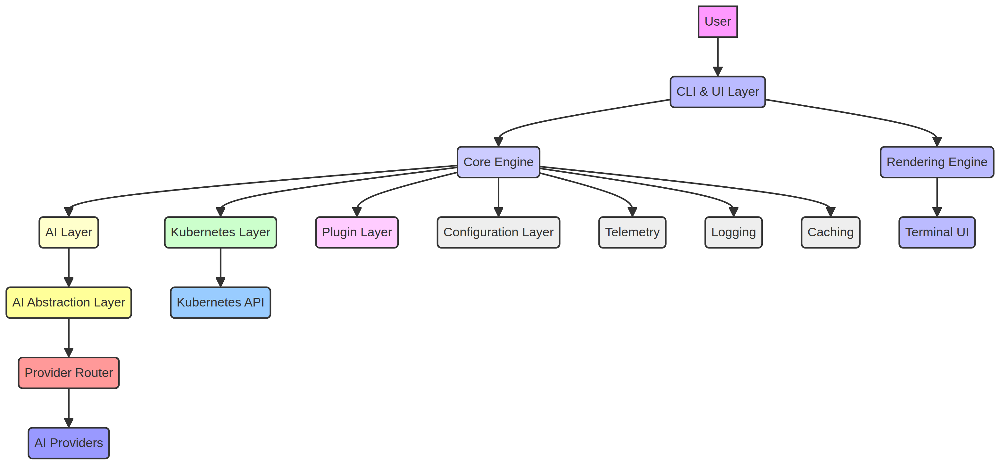
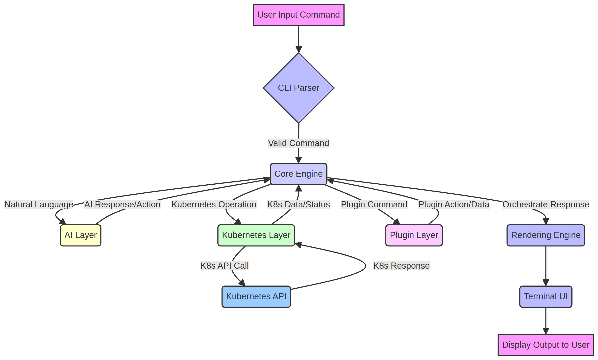
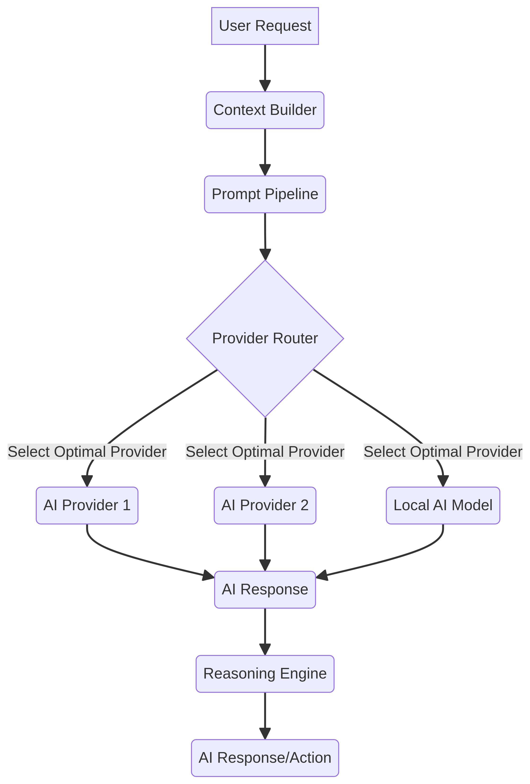
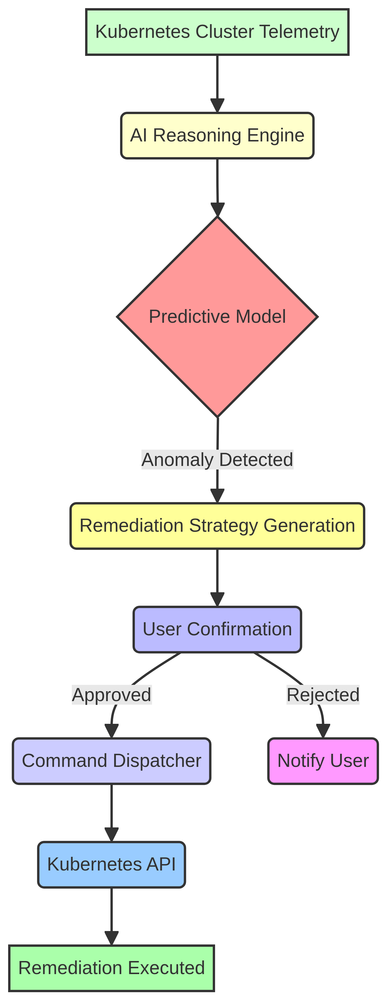

> [!IMPORTANT]
> **Chibi — Final Release Documentation (2026)**
> This documentation represents the final public release for GitHub. Stable / Open Source / 2026 Edition.

## System Architecture

Chibi's architecture is designed for modularity, extensibility, performance, and intelligent operation within a terminal-native environment. It integrates various components to provide a seamless AI-powered Kubernetes SRE experience.

### Overall Architecture Overview

Chibi operates as a sophisticated CLI application, orchestrating interactions between the user, Kubernetes clusters, and multiple AI providers. Its core design emphasizes a clear separation of concerns, allowing for independent development and evolution of its key layers:

1.  **CLI & UI Layer:** The user-facing component, handling input, rendering output, and managing the interactive terminal experience.
2.  **Core Engine:** The central nervous system, coordinating all internal operations, managing state, and dispatching tasks.
3.  **AI Layer:** The intelligence hub, responsible for natural language understanding, reasoning, and interaction with various AI models.
4.  **Kubernetes Layer:** The interface to the Kubernetes API, abstracting cluster interactions and data retrieval.
5.  **Plugin Layer:** An extensible framework allowing third-party integrations and custom functionalities.

These layers communicate through well-defined interfaces, ensuring robustness and maintainability. The architecture is designed to be highly responsive, providing real-time feedback and intelligent assistance directly within the developer's terminal.

### Component Breakdown

#### CLI

The Command Line Interface (CLI) is the primary interaction point for the user. It parses user commands, validates input, and initiates workflows within Chibi. It is built on a robust CLI framework (Cobra) to provide a familiar and efficient command-line experience.

#### Core Engine

The Core Engine acts as the central orchestrator of Chibi. It manages the overall application state, dispatches user requests to the appropriate internal layers (AI, Kubernetes, Plugin), and coordinates the flow of data and control. It ensures that all components work harmoniously to fulfill user commands and provide intelligent responses.

#### AI Layer

The AI Layer is responsible for all artificial intelligence functionalities within Chibi. It encompasses natural language processing for understanding user intent, a reasoning engine for diagnostics and recommendations, and an abstraction layer for interacting with various AI providers. This layer is crucial for Chibi's intelligent SRE capabilities.

#### Kubernetes Layer

The Kubernetes Layer provides a robust and efficient interface to interact with Kubernetes clusters. It utilizes the official `client-go` library to communicate with the Kubernetes API server, performing operations such as resource discovery, data retrieval (logs, events, metrics), and resource manipulation. This layer abstracts the complexities of Kubernetes API interactions from the rest of Chibi.

#### Plugin Layer

The Plugin Layer offers a secure and extensible framework for third-party developers to extend Chibi's capabilities. It defines an SDK and APIs that allow plugins to integrate new commands, data sources, AI models, or custom visualizations, enhancing Chibi's functionality without modifying its core codebase.

#### Configuration Layer

The Configuration Layer manages all application settings, user preferences, and AI provider configurations. It uses a flexible configuration management library (Viper) to support various configuration sources (files, environment variables, command-line flags) and ensures that Chibi's behavior is customizable and persistent.

#### Telemetry

The Telemetry component is responsible for collecting anonymous usage statistics and performance metrics. This opt-in system helps in understanding how Chibi is used, identifying performance bottlenecks, and guiding future development, all while respecting user privacy through anonymization.

#### Logging

The Logging component provides structured and configurable logging capabilities using Zap. It records internal operations, errors, and user interactions, which are essential for debugging, auditing, and monitoring Chibi's health and behavior.

#### Caching

The Caching component utilizes an in-memory cache (Ristretto) to store frequently accessed Kubernetes resources and AI responses. This significantly improves performance by reducing redundant API calls to Kubernetes and external AI providers, leading to faster response times and reduced costs.

#### Rendering Engine

The Rendering Engine is a specialized component responsible for generating rich, interactive terminal output. This includes advanced text formatting, color-coding, and dynamic visualizations like Mermaid diagrams, ASCII art, and live resource graphs, providing a visually engaging and informative user experience directly within the terminal.

#### Terminal UI

The Terminal User Interface (Terminal UI) is built upon the Rendering Engine and is responsible for presenting information to the user and capturing interactive input. It leverages frameworks like Bubble Tea, Lip Gloss, and Bubbles to create a modern, responsive, and aesthetically pleasing terminal experience, including animations, progress indicators, and interactive prompts.

#### Event System

The Event System provides a publish-subscribe mechanism for internal communication between Chibi's components. It allows different parts of the application to react to state changes or actions without tight coupling, enhancing modularity and maintainability.

#### State Management

State Management is crucial for maintaining consistency across Chibi's operations. It ensures that the application's internal state (e.g., current cluster context, active session data, user preferences) is accurately tracked and updated, providing a coherent experience across different commands and interactions.

#### Request Flow

The Request Flow defines the sequence of operations initiated by a user command. It starts with the CLI parsing the input, which then triggers the Core Engine to orchestrate calls to the AI Layer, Kubernetes Layer, and other components to process the request and generate a response.

#### Response Flow

The Response Flow describes how Chibi presents information back to the user. After a request is processed, the Core Engine gathers the results, which are then formatted and rendered by the Rendering Engine and Terminal UI, providing clear and actionable feedback to the user.

#### Prompt Pipeline

The Prompt Pipeline is a critical part of the AI Layer, responsible for constructing, optimizing, and managing prompts sent to AI providers. It ensures that prompts are context-rich, token-efficient, and tailored to elicit the most accurate and relevant responses from the selected AI model.

#### Streaming Pipeline

The Streaming Pipeline handles real-time data streams, particularly for AI responses and Kubernetes logs. It enables Chibi to provide immediate, continuous feedback to the user, enhancing the interactive experience and reducing perceived latency.

#### AI Abstraction Layer

The AI Abstraction Layer provides a unified interface for Chibi to interact with diverse AI providers. It decouples the core logic from specific AI model implementations, allowing for seamless integration of new models and dynamic selection based on task requirements.

#### Provider Router

The Provider Router, part of the AI Abstraction Layer, intelligently directs AI requests to the most suitable AI provider. This routing decision is based on factors such as the nature of the query, required response time, cost considerations, and the capabilities of available AI models.

#### Provider Selection

Provider Selection is the mechanism by which the Provider Router determines the optimal AI model. It considers pre-configured user preferences, real-time performance metrics, cost-effectiveness, and the specific demands of the AI task to make an informed choice.

#### Context Builder

The Context Builder, within the AI Layer, is responsible for gathering and synthesizing relevant information to enrich AI prompts. This includes current Kubernetes cluster state, historical interactions, user preferences, and relevant documentation, ensuring that AI responses are highly contextual and accurate.

#### Reasoning Engine

The Reasoning Engine is the core intelligence component of the AI Layer. It processes contextualized prompts, performs complex analysis (e.g., diagnosing issues, generating solutions), and formulates intelligent responses or recommendations based on its understanding of Kubernetes and SRE best practices.

#### Terminal Renderer

The Terminal Renderer is a specialized part of the Rendering Engine focused on outputting visual elements directly to the terminal. This includes formatting text, applying colors, and generating interactive diagrams (like Mermaid charts) and other graphical representations to enhance user comprehension.

#### Command Dispatcher

The Command Dispatcher, residing within the Core Engine, is responsible for executing internal Chibi commands or translating them into external calls (e.g., to the Kubernetes API or system utilities). It ensures that user intentions are correctly translated into executable actions within the Chibi ecosystem.

### Overall System Architecture Diagram

### User Command Request Flow

### AI Layer Internal Workflow

### Predictive Incident Analysis and Autonomous Remediation Workflow

## References

[1] Kubernetes. (n.d.). *kubectl Overview*. Retrieved from [https://kubernetes.io/docs/reference/kubectl/overview/](https://kubernetes.io/docs/reference/kubectl/overview/)
[2] k9s. (n.d.). *k9s - Kubernetes CLI To Manage Your Clusters In Style!*. Retrieved from [https://k9scli.io/](https://k9scli.io/)
[3] Lens. (n.d.). *The Kubernetes IDE*. Retrieved from [https://k8slens.dev/](https://k8slens.dev/)
[4] Headlamp. (n.d.). *An extensible Kubernetes UI*. Retrieved from [https://headlamp.dev/](https://headlamp.dev/)
[5] Radar. (n.d.). *Radar - The Kubernetes UI*. Retrieved from [https://radarhq.io/](https://radarhq.io/)
[6] SRExpert. (n.d.). *Unified Kubernetes Management Platform*. Retrieved from [https://srexpert.io/](https://srexpert.io/)
[7] Kubeshark. (n.d.). *API Traffic Viewer for Kubernetes*. Retrieved from [https://kubeshark.co/](https://kubeshark.co/)
[8] Komodor. (n.d.). *Autonomous AI SRE Platform for Kubernetes*. Retrieved from [https://komodor.com/](https://komodor.com/)
[9] Kubecost. (n.d.). *Kubernetes Cost Monitoring & Optimization*. Retrieved from [https://www.kubecost.com/](https://www.kubecost.com/)
[10] Devtron. (n.d.). *AI-Native Kubernetes Management Platform*. Retrieved from [https://devtron.ai/](https://devtron.ai/)
[11] Portainer. (n.d.). *Universal Container Management Platform*. Retrieved from [https://www.portainer.io/](https://www.portainer.io/)
[12] Aider. (n.d.). *AI pair programming in your terminal*. Retrieved from [https://aider.chat/](https://aider.chat/)
[13] OpenCode. (n.d.). *Open-source AI coding agent*. Retrieved from [https://github.com/opencode/opencode](https://github.com/opencode/opencode)

